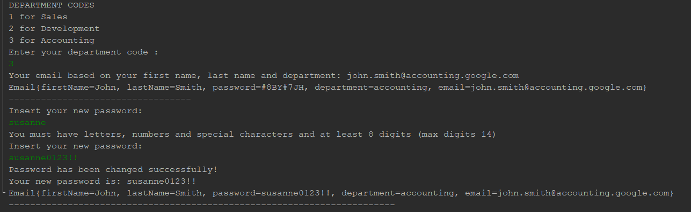

# Email
Create an email based on first name, last name and the department you've choosen.

It creates a random password.
After the mail has been created you can modify the password but must have letters, numbers and special characters and at least 8 digits (max digits 14).

